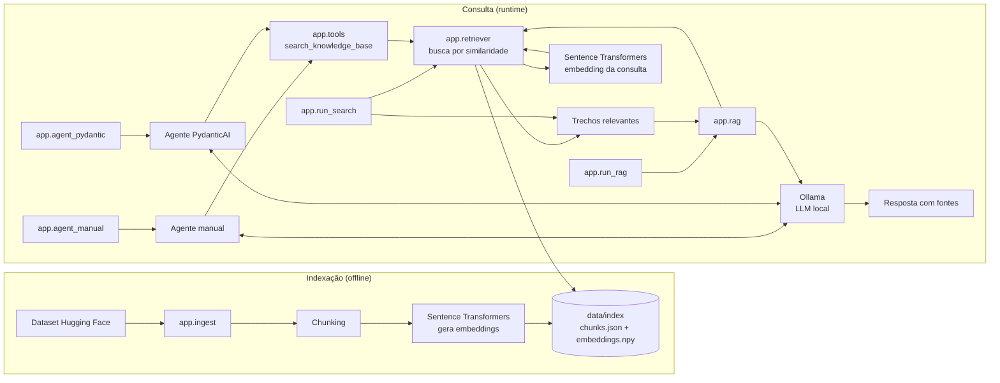

# Arquitetura

```mermaid
flowchart LR
	subgraph Indexacao["Indexação (offline)"]
		Dataset["Dataset Hugging Face"] --> Ingest["app.ingest"]
		Ingest --> Chunking["Chunking"]
		Chunking --> EmbedDocs["Sentence Transformers<br/>gera embeddings"]
		EmbedDocs --> Index[("data/index<br/>chunks.json + embeddings.npy")]
	end

	subgraph Consulta["Consulta (runtime)"]
		SearchCLI["app.run_search"] --> Retriever
		RagCLI["app.run_rag"] --> RAG["app.rag"]
		ManualCLI["app.agent_manual"] --> ManualAgent["Agente manual"]
		PydanticCLI["app.agent_pydantic"] --> PydanticAgent["Agente PydanticAI"]

		RAG --> Retriever["app.retriever<br/>busca por similaridade"]
		ManualAgent <--> Ollama["Ollama<br/>LLM local"]
		PydanticAgent <--> Ollama
		ManualAgent --> Tool["app.tools<br/>search_knowledge_base"]
		PydanticAgent --> Tool
		Tool --> Retriever

		Retriever --> Index
		Retriever --> EmbedQuery["Sentence Transformers<br/>embedding da consulta"]
		EmbedQuery --> Retriever
		Retriever --> Results["Trechos relevantes"]
		Results --> RAG
		RAG --> Ollama
		Ollama --> Answer["Resposta com fontes"]
		SearchCLI --> Results
	end
```
